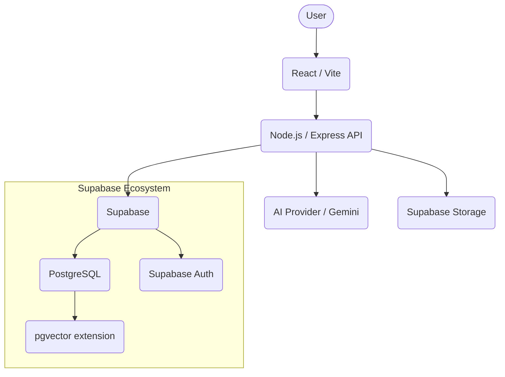

# System Architecture

## Overview

## AI Integration Flow
1. **Requirements to Test Cases**
   - User inputs or uploads a requirement.
   - Backend chunks the text and prompts the AI Provider.
   - AI Provider returns a structured JSON payload of Test Case Candidates.
   - Human User reviews and accepts/rejects the candidates.

2. **Quality Evaluation**
   - User requests a quality check on an existing test case.
   - Backend sends the test case text to the AI Provider.
   - AI Provider scores the case on Completeness, Clarity, Relevance, and Consistency, and provides actionable suggestions.

## Duplicate Detection Architecture
1. **Embedding Generation**: 
   - A canonical text representation of the test case is hashed.
   - The AI Provider generates vector embeddings representing the semantic meaning of the test case.
2. **Similarity Search**: 
   - Uses `pgvector` inside PostgreSQL to query for existing vectors with a cosine similarity > 0.85.
3. **Flagging**: 
   - Similar test cases are flagged as `semantic` or `exact` duplicates, inserted into `test_case_duplicates` for human review.
